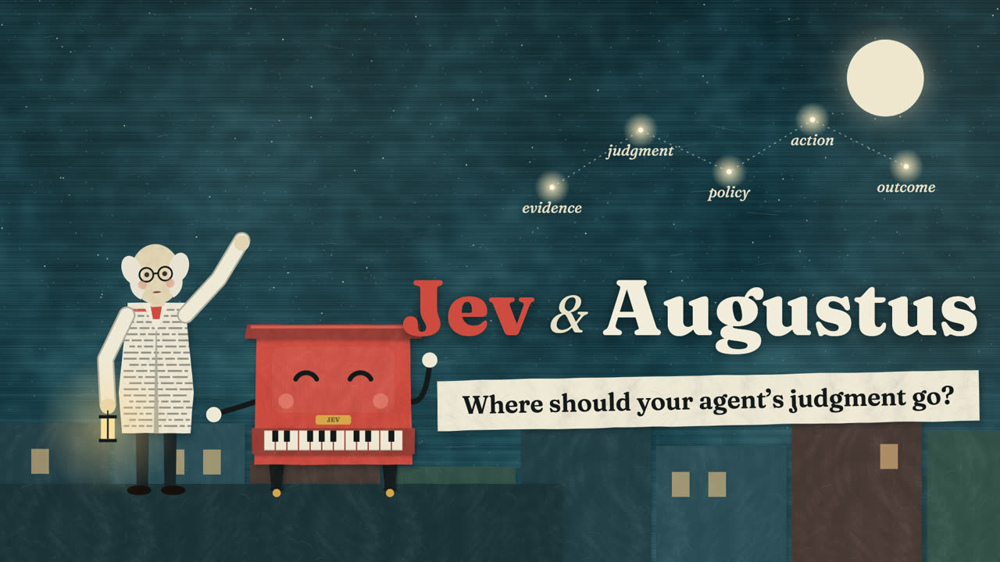

# Augustus

Find, build, evaluate, and improve systems with decision models.

[](LICENSE)
[](https://github.com/24601/Augustus/releases)
[](https://github.com/24601/Augustus/actions/workflows/quality.yml)
[](https://24601.github.io/Augustus/)

Augustus equips agents to **find useful placements, build decision-driven
systems, create evaluations, and hill-climb them against real outcomes**.
Reach for it when a step could be code, an LLM call, a classifier or ranker,
or a person; when a confidence score needs a threshold, abstention, or a human
fallback; or when a prompt or program needs an eval before you optimize it.
It draws on decision theory, value of information, multi-criteria analysis,
signal detection, search/control, and formal-methods boundaries across
software, business, organizations, research, and everyday decisions.

[TypeSafe Jev](https://docs.typesafe.ai/) (Choice, Score, Noul) is the
default hosted exemplar. The skill also covers classical classifiers,
encoders, open decision heads, constrained readouts, rankers, and vision
scorers. Choose the family by the task, then test it against the baseline.
Sometimes the best result is a formula, a checklist, or no new model.

The working model is:

**evidence → bounded judgment → explicit policy → checked action → observed outcome**

Augustus is independent of TypeSafe. The
[official TypeSafe skill](https://github.com/typesafe-ai/skills) and current
provider docs own API contracts; Augustus supplies composition, implementation,
evaluation, and improvement methods. Named for
Augustus De Morgan, mentor of William Stanley Jevons.

[](https://youtu.be/ZC4oge4WsCQ)

**[Watch the 2:38 film](https://youtu.be/ZC4oge4WsCQ)**: Jevons' logic piano,
De Morgan's boundary, and how Augustus places and tests a bounded judgment.

## Try it

After installation, ask your agent:

> Use Augustus to audit our refund-email workflow. Find the smallest
> useful classifier insertion, keep eligibility and payments in code,
> and propose an evaluation that could reject the change.

> Use Augustus to compare ways our library could choose three programs
> under a fixed budget. Make the values, evidence gaps, and tradeoffs explicit.

> Use Augustus to review this confidence threshold. Explain what the score
> means, when to abstain, and what we should measure on held-out cases.

> Use Augustus to build a decision-model router and its evaluation harness.
> Keep our incumbent runnable, test complete episode outcomes, and set up a
> bounded improvement loop with untouched confirmation data and rollback.

Advice produces a concise design card and falsifier. Build requests produce
working adapters, policy and evals; improvement requests produce a bounded
incumbent–challenger loop. The agent reads only relevant references. Source
popularity and proxy-score gains do not establish improvement.

## Examples

| Problem | Placement | Evaluate |
| --- | --- | --- |
| Expensive generated-JSON email routing | Bounded intent classifier before existing handlers | Action errors, review coverage, total cost |
| Search results need ordering | Retrieve candidates, then rank relevance | Recall, nDCG, final task success |
| Many plausible projects under a budget | Explicit utility/MCDA with exact constraints | Sensitivity, feasibility, stakeholder outcomes |
| Agent claims it is finished | Judge evidence gaps; verify artifacts and effects | False completion and recovery on real tasks |
| Need a decision under uncertainty | Compare act, defer, and gather-more-evidence | Expected loss and value of information |
| Model appears to approve a risky action | Treat judgment as evidence inside host policy | Unauthorized effects, failure paths, drift |

A typed response is not proof of truth. Ranking scores, probability,
confidence, calibration, and action success have different meanings.
See [the working skill](.agents/skills/augustus/SKILL.md).

## Install

Install the published release, 0.8.0 (both skills):

```bash
# Claude Code
claude plugin marketplace add 24601/Augustus@v0.8.0
claude plugin install augustus@augustus

# Codex, Cursor, and other Skills CLI agents
npx skills add https://github.com/24601/Augustus/tree/v0.8.0 --skill augustus augustus-train
```

To follow the default branch, which may contain unreleased `-dev` work, use
`claude plugin marketplace add 24601/Augustus` or
`npx skills add 24601/Augustus --skill augustus augustus-train`. A pinned install stays on
its tag. To move a Claude Code install to another tag, run
`claude plugin marketplace remove augustus`, then add and install again.
For a manual install, copy both directories under `.agents/skills/` with their
references and scripts; Codex reads user skills from `~/.agents/skills/`.

### Train an application-specific decision model

The package includes `augustus-train` alongside `augustus`.
It guides an agent through task-specific data assembly, candidate selection,
fitting, export/reload, and bounded improvement under application costs and
constraints. It is not a pretrained model, a hosted training service, or a
recipe for reproducing a general instruction-conditioned Jev engine.

The trainer uses optional evaluation helpers in the companion skill; training
dependencies and any compute spend depend on the selected recipe.

> Use augustus-train to turn our labeled support records into a local routing
> component. Compare feasible methods under our error costs and latency budget,
> keep ambiguous and out-of-scope cases explicit, and deliver a reloadable
> artifact with an evaluation. Then run a bounded improvement loop without
> using the final evaluation data to tune it. Keep the incumbent if it wins.

The [development acceptance audit](research/audits/2026-09-26-trainer-journeys/README.md)
includes replayable binary and 150-intent CPU training journeys, bounded candidate
selection, fresh-process inference, and a no-training exact-rule result. These
are public-proxy/fixture executions, not production or general-Jev claims.

The skill needs no API key to provide design guidance. Calling Jev or another
hosted provider is a separate, optional integration with its own credentials
and costs. Review installed instructions before granting any agent access.

In Claude Code, invoke `/augustus` (a plugin install also answers to
`/augustus:augustus`); in Codex, use `$augustus`. With many skills installed,
a host may shorten or drop skill descriptions, so name the skill explicitly if
it is never chosen. If it is not visible, reload your agent's skills/plugins.
Check the installed version with `claude plugin details augustus@augustus` or
`metadata.version` in the installed `SKILL.md`. See
[worked examples](https://24601.github.io/Augustus/examples.html) for the kind
of result to expect. Avoid installing the same skill by multiple methods in
one agent.

## Project and evidence

- [Skill and reference index](.agents/skills/augustus/SKILL.md): runtime guidance.
- [Research archive](research/README.md): primary sources, historical claims,
  revisits, and the current decision-model review.
- [Contributing](CONTRIBUTING.md): content boundaries, tests, behavioral review.
- [Changelog](CHANGELOG.md): product changes, separate from research observations.
- [Website](https://24601.github.io/Augustus/): examples and ecosystem orientation.
- [Feedback](https://github.com/24601/Augustus/issues/new/choose): installation
  problems, mistaken activation, and sanitized real-world failures.

For local development, install `requirements-dev.txt` and run `make check`.
The offline helpers evaluate labeled binary predictions and paired workflow
outcomes; neither calls a model. The
[composition calculus](.agents/skills/augustus/references/composition-algebra.md)
and [build/improvement workflow](.agents/skills/augustus/references/optimizer-integration.md)
connect methods to implementation and evidence. Tests and structural lint do
not establish model quality or deployment benefit.

## Versioning

Published release: **0.8.0**. See the
[release notes](docs/release-notes-v0.8.0.md) for changes and migration details.
Install from the `v0.8.0` tag for the published revision; default-branch installs
can receive later development work.

Historical TypeSafe skill provenance: v0.5.7 (`65a39f3`), rechecked on
2026-09-23 as that repository's latest tag and HEAD. Read live provider docs
before writing integration code; that pin is not a current API guarantee.

## License

MIT. See [LICENSE](LICENSE). Security reports: [SECURITY.md](SECURITY.md).
Contributions: [CONTRIBUTING.md](CONTRIBUTING.md).
